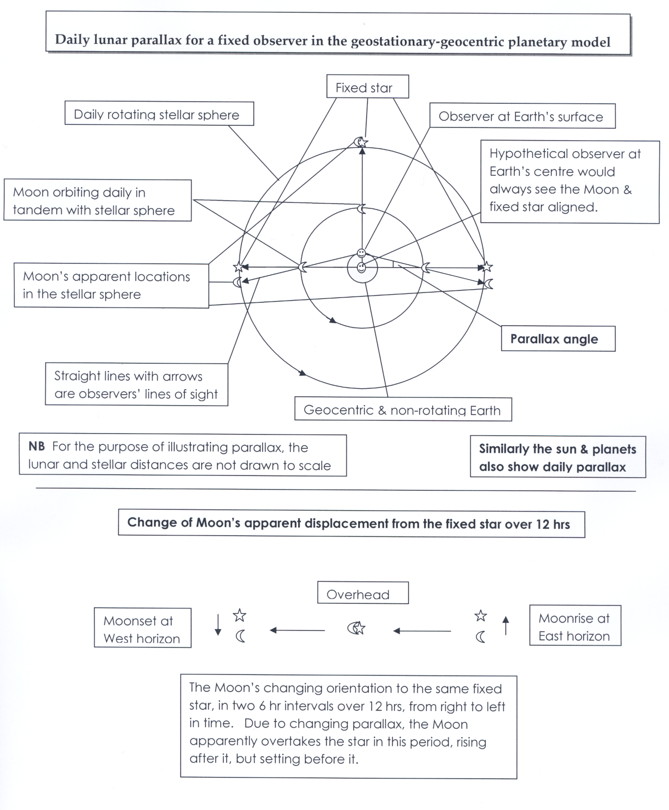

# DiurnalParallax

## 简介 

DiurnalParallax 是一个关于天体坐标的周日视差的计算组件，可用以转换站心与地心坐标。

以月球为例，其周日视差的示意图：



## 用例

```js
const Astraeus = require('@behaver/astraeus.js');

const angle = new Astraeus.Angle;

// 观测时间
let date = new Date('2003/08/28 11:17:00');

// 观测儒略时间
let jdate = new Astraeus.JDate(date, 'date');

// 观测位置经纬
let obGeoLong = angle.parseDACString('116°51′50″').getDegrees();
let obGeoLat = angle.parseDACString('33°21′21″').getDegrees();

// 观测位置海拔高度，单位：千米
let obElevation = 1713;

// 观测位置恒星时对象
let siderealTime = new Astraeus.SiderealTime(jdate, obGeoLong);

// 天体距离，单位：AU
let r = 0.37276;

// 天体球坐标 theta 值
let theta = angle.setDegrees(90 + 15.771083).getRadian();

// 天体球坐标 phi 值
let phi = angle.setDegrees(339.530208).getRadian();

// 天体位置赤道球坐标
let gc = new Astraeus.SphericalCoordinate3D(r, theta, phi);

// 实例化周日视差
let dp = new Astraeus.DiurnalParallax({
  gc,
  siderealTime,
  obGeoLat,
  obElevation,
  system: 'equinoctial',
});

// 获取站心球坐标
let tc = dp.TC;
```

## API

`constructor(options)`

构造函数，接口同 init 方法

`init(options)`

初始化方法

规定参数：

* options.gc 地心球坐标，参数类型为 SphericalCoordinate3D 对象
* options.tc 站心球坐标，参数类型为 SphericalCoordinate3D 对象
* options.obGeoLat 观测位置地理纬度，单位：度，值域：[-90, 90]
* options.obElevation 观测位置海拔高度，单位：米，值域：[-12000, 3e7]
* options.siderealTime 观测位置的当地真恒星时对象，参数类型为 SiderealTime 对象
* options.system 球坐标系统类型，可选用：equinoctial(赤道坐标) 和 horizontal(地平坐标)，默认为：equinoctial

`set TC(tc)`

设置站心球坐标对象

参数类型为 SphericalCoordinate3D 对象，规定参数球坐标中 r 值单位为：AU

`get TC()`

获取站心球坐标对象

`set GC(gc)`

设置地心球坐标对象

参数类型为 SphericalCoordinate3D 对象，规定参数球坐标中 r 值单位为：AU

`get GC()`

获取地心球坐标对象

[返回主页](../../readme.md)
