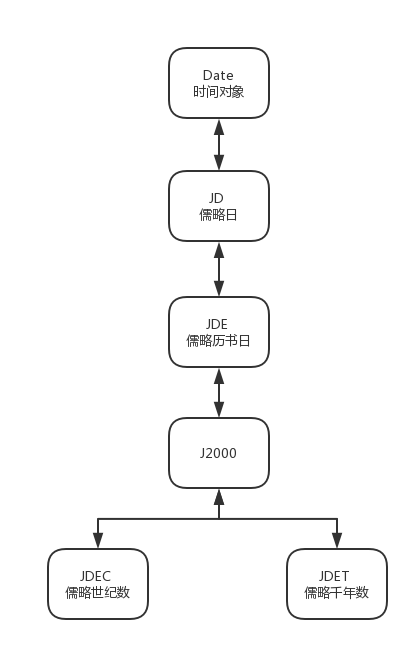

# JDate

## 简介

JDate 是儒略日 Julian Date 的缩写，这是一种主要应用于 **天文学领域** 的计时方法。值得注意的是，儒略日 与 儒略历 并无实际联系，儒略历 是由罗马共和国独裁官尤利乌斯·恺撒（Julius Caesar）颁布的历法，儒略（Julian）一词即来自于尤利乌斯（Julius），从公元前45年1月1日开始执行起，至1582年教皇格里高利十三世颁布推行格里高利历为止，儒略历作为这一期间主要的历法。本模块所涉及的儒略日是天文学领域内常用的计时方法。起点（零点）时间为儒略历的公元前4713年1月1日中午12点（在格里历是公元前4714年11月24日），2000年1月1日的UT12:00是儒略日2,451,545。

本组件除了涉及 **儒略日（JD）** 的计算，还涉及由其衍生而出的 **儒略历书日（JDE）** 、 **儒略世纪数** 和 **儒略千年数** 等的计算	

## 功能

1. 儒略日 JD 的计算
2. 儒略历书日 JDE 的计算
3. 儒略历书日 J2000 的计算
4. 儒略世纪数 和 儒略千年数 的计算
5. 儒略时间及 Date 时间之间的相互转换

## 用例

获取一个 Date 对象所对应的 儒略时间 数值：

```js
const Astraeus = require('@behaver/astraeus.js');

let d = new Date('1992/8/15');
let jdate = new Astraeus.JDate(d, 'date');

// 儒略日
let jd = jdate.JD;

// 儒略历书日
let jde = jdate.JDE;

// J2000 历书日
let j2000 = jdate.J2000;

// 儒略世纪数
let jdec = jdate.JDEC;

// 儒略千年数
let jdet = jdate.JDET;
```

其中 JDate 构造函数的第二参数表示第一参数的类型，它被要求是字符串类型，并有以下值可选：

* `date` Date 对象
* `jd` 儒略日(JD)
* `jde` 儒略历书日(JDE)
* `j2000` 以 J2000 为起始历元的儒略历书日
* `jdec` 儒略世纪数
* `jdet` 儒略千年数

参数缺省值：`jd`

---

将一个 儒略日(JD) 数值转换得到一个 Date 对象

```js
const { JDate } = require('@behaver/jdate');
let jdate = new JDate(2446896.30625);

// 对应时间为：1987/4/11 03:21:00 （北京时间）
let d = jdate.date;
```

## 运算结构



## API

`constructor(d, dtype)`
构造函数，参数 `d` 为日期值，`dtype` 为日期值 `d` 的类型。包含以下类型：

* `date` Date 对象
* `jd` 儒略日(JD)
* `jde` 儒略历书日(JDE)
* `j2000` 以 J2000 为起始历元的儒略历书日
* `jdec` 儒略世纪数
* `jdet` 儒略千年数

其缺省值为 `jd`

`get date()`
获取 Date 对象

`set date(date)`
设置 Date 对象

`get JD()`
获取 **儒略日**（世界时[UT] 标准）

`set JD(jd)`
设置 **儒略日**（世界时[UT] 标准），非负值

`get JDE()`
获取 **儒略历书日**（历书时[ET] 标准，或者说是力学时[TD] 标准）
其中 E 代表使用历书时，即按照每天 86400 个标准秒长严格计日

`set JDE(jde)`
设置 **儒略历书日**（历书时[ET] 标准，或者说是力学时[TD] 标准）
其中 E 代表使用历书时，即按照每天 86400 个标准秒长严格计日

`get J2000()`
获取以 J2000 历元为起始的儒略历书日，由儒略历书日 JDE 衍生

`set J2000(j2000)`
设置以 J2000 历元为起始的儒略历书日，由儒略历书日 JDE 衍生

`get JDEC()`
获取 **儒略世纪数** ，由 J2000 衍生

`set JDEC(jdec)`
设置 **儒略世纪数** ，由 J2000 衍生

`get JDET()`
获取 **儒略千年数** ，由 J2000 衍生

`set JDET(jdet)`
设置 **儒略千年数** ，由 J2000 衍生

`get JEpoch()`
获取 **儒略纪元** ，由 J2000 衍生

`set JEpoch(je)`
设置 **儒略纪元** ，由 J2000 衍生

`get BEpoch()`
获取 **贝塞尔纪元**

`set BEpoch(be)`
设置 **贝塞尔纪元**

[返回主页](../../../readme.md)
